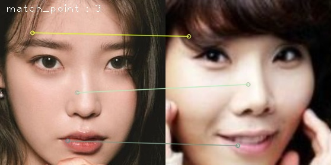
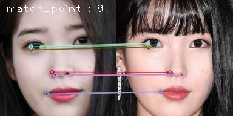
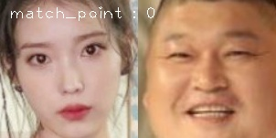
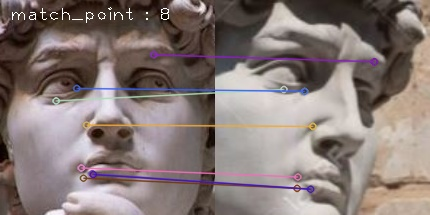
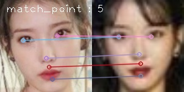
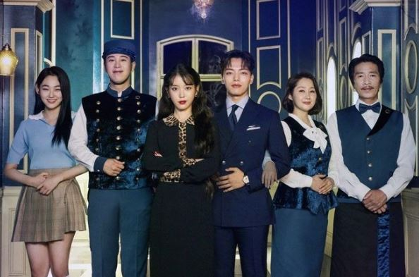

# opencv_haar_cascade_feature_matching

- mini project (opencv)

## Haar Cascades & feature matching

Compare with the similar faces and with same object having different scene

1. compare IU and the other people

2. compare David scenes

   

## parameter

- CascadeClassifier : data/haarcascades/haarcascade_frontalface_alt.xml
  - Using Opencv basic xml file : haarcascade_frontalface
- keypoint detecting and matching : SIFT algorithm (keypoint 10000)
  - Ration Test : 0.8
  - Distance Cut (for inliers) : 20 pixel

### Process

1. Detecting a face
2. Crop the face in the scene
3. matching the 2 scene

## Result

1. IU and Bong Sun

   - matching keypoint : 3

     

2. IU and IU

   - matching keypoint : 8

     

3. IU and Ho Dong

   - matching keypoint : 0

     

   

4. David and David
   
   - matching keypoint : 8

5. find IU in people

   - matchin keypoint : 5

     

     - Origin right image (many people)

     

     

### **Analysis**

1. Feature matching can classify another class
   - same classes are many matching keypoints
2. Feature matching recognize  same features like eyes, lips, nose
3.  SIFT algorithm is strong in Homograpy

